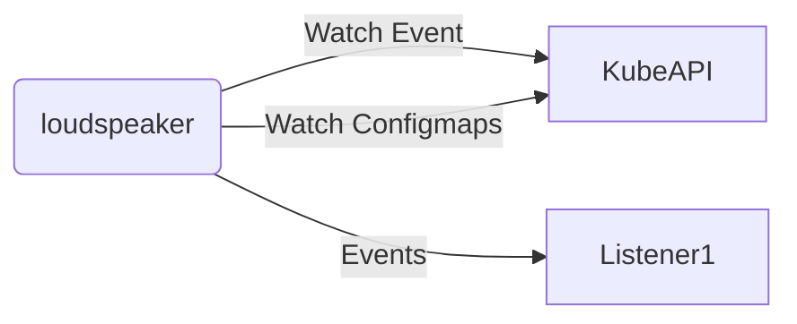

# Loudspeaker Runtime

[](https://opensource.org/licenses/MIT)
[](https://hub.docker.com/repository/docker/masanetes/loudspeaker-runtime)
[](https://pkg.go.dev/github.com/masanetes/loudspeaker-runtime)
[](https://github.com/masanetes/loudspeaker-runtime/actions/workflows/test.yaml)
[](https://goreportcard.com/report/github.com/masanetes/loudspeaker-runtime)
[](https://codecov.io/gh/masanetes/loudspeaker-runtime)

Get the kubernetes event from the WatchAPI and send it to the target.



# Settings

## Required Environment

|Environment|Details|
|-|-|
|Type|Listener Type. This will change the format of the credentials to be read.|
|ConfigmapName|The name of the configmaps to load the configuration from.|
|Namespace|Specify the namespace of configmaps to be monitored by WatchAPI.|

## Configmaps data format

```yaml
observes:
  - namespace: "default"
    ignoresReasons:
      - ""
    involvedObjectNames: 
      - "sample-cronjob"
    involvedObjectKinds:
      - "Cronjob"
    eventTypes:
      - "Warning"
```

Refer to the CRD API specification for a description of each field.
https://pkg.go.dev/github.com/masanetes/loudspeaker@v0.0.6/api/v1alpha1
